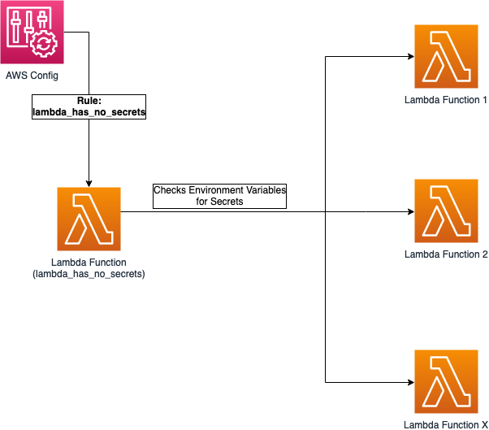

# aws-config-detect-environment-variables-secrets

Code to deploy a solution to detect secrets/tokens in Lambda functions using AWS Config.

## Table of Contents

- [Description](#description)
- [Prerequisites](#prerequisites)
- [Dependencies](#dependencies)
- [Variables](#variables)
- [Usage](#usage)
    - [Preparing the Lambda layers (Bash Script)](#preparing-the-lambda-layers-bash-script)
    - [Deploying the code (Terraforms)](#deploying-the-code-terraforms)
- [Security](#security)
- [License](#license)


## Description

This Terraform module create a custom rule on AWS Config that detects secrets/tokens in the Lambda functions in the account.

The following diagram applies to the current solution.



Once a secret/token is identified in the environment variables of a Lambda function, they are flagged as NON_COMPLIANT with an annotation showing the type of the detected secret. (Example: _JSON Web Token_)
The AWS Config rule is triggered at any modification of every environment variable in each Lambda functions in the account.

> Pay attention:
this module is meant to be used as standalone module.

## Prerequisites
 
* **AWS Config**: 
This module expects that [AWS Config](https://aws.amazon.com/config/) is already up and running in the region where the rules will be deployed.
The setup can be easily carried out by following the official [documentation](https://docs.aws.amazon.com/config/latest/developerguide/setting-up-aws-config-rules-with-console.html).

* **Docker**:
In order to properly deploy the resources to your account, Docker needs to be installed on your machine. Please refer to this [link](https://docs.docker.com/get-docker/).

## Dependencies

* **rdklib**: 0.2.0 [Reference](https://github.com/awslabs/aws-config-rdklib);
* **detect-secrets**: 1.1.0 [Reference](https://github.com/Yelp/detect-secrets)

## Variables

The available variables are described in [variables.tf](./variables.tf) file.

## Usage

In this example we are going to deploy the custom rule that will automatically check all lambda functions for vulnerable environment variables.

### Preparing the Lambda layers (Bash Script)

The lambda function that will be leveraged to carry out the detection process uses two libraries [rdklib](https://github.com/awslabs/aws-config-rdklib) and [detect-secrets](https://github.com/Yelp/detect-secrets)
Therefore, you need to first ensure those libraries are available to the function in your account as lambda layers.

Use this command in your terminal to prepare them for Terraforms to deploy them in the following section:

```bash
cd scripts
./build.sh
```

### Deploying the code (Terraforms)

**Option 1:**
You can use the following sample to utilize the module within your code:

```yaml
module "deploy_lambda_secrets_detector_rule" {
  config_rule_name = "lambda_has_no_secrets"
  source           = "./modules/lambda_has_no_secrets"
  enabled          = true
}
```
Please have a look inside inside [variables.tf](./variables.tf) for all the possible options.

**Option 2:**
Alternatively, if you have [Terraform](https://www.terraform.io/) installed on your workstation, you can deploy the example by executing:

```bash
export AWS_PROFILE=$MY_AWS_PROFILE
terraform init
terraform apply
```

> Pay attention:
you should first modify the `region` in your AWS Profile in accordance to your requirements.


## Security

See [CONTRIBUTING](CONTRIBUTING.md) for more information.

## License

This project is licensed under the Apache-2.0 License.